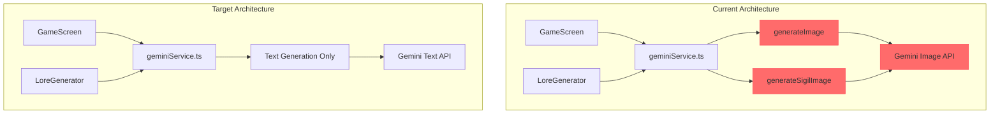
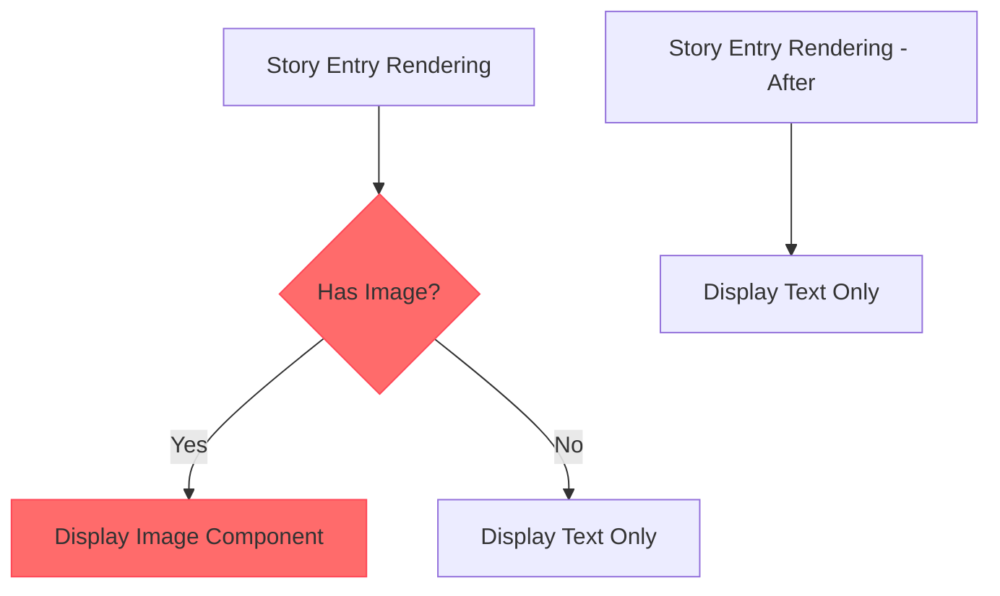
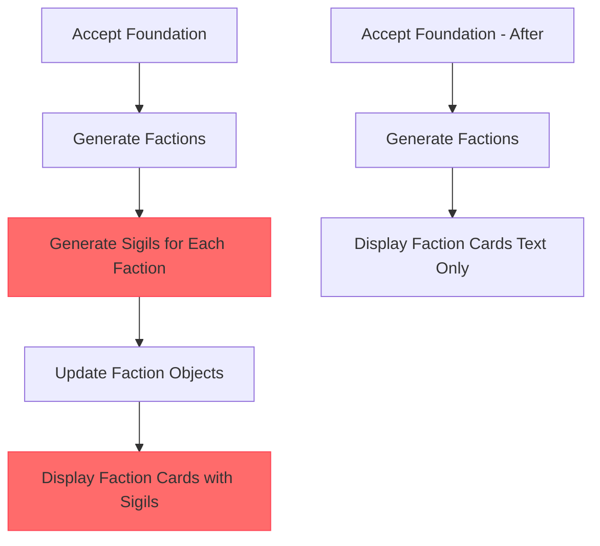

# Remove Image Generation Feature Design

## Overview

This design document outlines the removal of image generation capabilities from the gemini-text-adventure-rpg application. The current app integrates AI-powered image generation for both faction sigils and scene illustrations during gameplay. This modification will eliminate these features to create a purely text-based experience while maintaining all core gameplay functionality.

## Current Image Generation Features

### 1. Scene Image Generation
- **Function**: `generateImage()` in `geminiService.ts`
- **Purpose**: Creates visual representations of game scenes during narrative moments
- **Triggers**: When AI response includes `requestImageGeneration: true`
- **Model**: Uses `gemini-2.5-flash-image-preview`
- **Usage**: GameScreen component displays images in story log entries

### 2. Faction Sigil Generation  
- **Function**: `generateSigilImage()` in `geminiService.ts`
- **Purpose**: Creates emblematic symbols for world factions during lore generation
- **Triggers**: Automatically during faction creation in LoreGenerator
- **Model**: Uses `gemini-2.5-flash-image-preview` 
- **Usage**: Displays faction sigils in LoreGenerator and faction cards

## Architecture Changes

### Service Layer Modifications



### Data Model Updates

#### Type Definitions (types.ts)
- **Remove**: `requestImageGeneration` field from `GeminiResponse` interface
- **Remove**: `sigilImageUrl` field from `Faction` interface  
- **Remove**: `imageUrl` and `imageIsLoading` fields from `StoryEntry` interface

#### Service Interface Changes
- **Remove**: `generateImage()` function export
- **Remove**: `generateSigilImage()` function export
- **Update**: AI prompt instructions to remove image generation requests

## Component Modifications

### GameScreen Component

#### Image Display Removal


#### Changes Required:
1. **Remove image processing logic** from `executeAction()` method
2. **Remove image loading states** and spinner displays
3. **Remove initial image generation** on game start
4. **Simplify story entry rendering** to text-only display

### LoreGenerator Component  

#### Sigil Generation Removal


#### Changes Required:
1. **Remove sigil generation loop** from `handleAcceptFoundation()`
2. **Remove sigil loading states** and progress messages
3. **Update FactionCard component** to remove image display logic
4. **Simplify faction presentation** to text-based cards only

## AI Integration Updates

### Prompt Engineering Changes

#### Current Image Generation Triggers
```typescript
// Current prompt includes:
"10. **Image Generation:** Set 'requestImageGeneration' to true ONLY if..."
```

#### Updated Prompt Structure  
```typescript
// Remove image generation instructions entirely
// Focus on narrative quality and text descriptions
// Enhanced descriptive language to compensate for visual removal
```

### Response Schema Modifications

#### Before:
```typescript
requestImageGeneration: { 
  type: Type.BOOLEAN, 
  description: "Set to true ONLY for visually significant moments..." 
}
```

#### After:
```typescript
// Complete removal of requestImageGeneration field
// Enhanced narrative field to include richer descriptions
```

## User Experience Impact

### Positive Changes
- **Faster Response Times**: Eliminates image generation latency
- **Reduced API Costs**: No image model usage
- **Improved Accessibility**: Text-only interface is screen reader friendly  
- **Lower Bandwidth**: No image downloads during gameplay

### Mitigation Strategies
- **Enhanced Descriptive Text**: AI prompts emphasize vivid, immersive descriptions
- **Rich Typography**: Use styling to create visual hierarchy in text
- **Symbolic Representations**: ASCII art or unicode symbols for faction identities
- **Color Coding**: Text-based visual cues for different content types

## Implementation Strategy

### Phase 1: Service Layer Cleanup
1. Remove image generation functions from `geminiService.ts`
2. Update AI prompt templates to remove image instructions
3. Modify response schemas to exclude image-related fields

### Phase 2: Type System Updates  
1. Update interface definitions in `types.ts`
2. Remove image-related properties from data models
3. Update component prop interfaces accordingly

### Phase 3: Component Refactoring
1. Modify GameScreen to remove image display logic
2. Update LoreGenerator to skip sigil generation
3. Remove image loading states and error handling
4. Enhance text presentation styling

### Phase 4: Testing and Validation
1. Verify all image-related code is removed
2. Test complete lore generation workflow
3. Validate gameplay experience remains engaging
4. Confirm no broken references or unused imports

## Technical Considerations

### Removed Dependencies
- **Image Generation Model**: `gemini-2.5-flash-image-preview` no longer required
- **Base64 Processing**: Canvas manipulation logic can be removed
- **Image State Management**: Loading and error states for images

### Preserved Functionality
- **Core Narrative Engine**: All text generation remains intact
- **Game Mechanics**: Character progression, inventory, quests unchanged
- **World Building**: Lore generation continues with text descriptions
- **Interactive Elements**: Tooltips, tabs, and UI interactions maintained

### Performance Benefits
- **Reduced Memory Usage**: No image caching or storage
- **Faster Load Times**: Eliminates image download delays  
- **Simplified Error Handling**: No image-specific error scenarios
- **Lower Complexity**: Removes async image processing workflows

## Validation Criteria

### Functional Requirements
- ✅ Game starts and progresses without image dependencies
- ✅ Lore generation completes successfully without sigil creation
- ✅ Faction display works with text-only presentation
- ✅ Story progression maintains engagement through enhanced descriptions

### Technical Requirements  
- ✅ No image-related API calls or model usage
- ✅ Clean removal of unused code and imports
- ✅ Type safety maintained after interface changes
- ✅ No runtime errors related to missing image properties

### User Experience Requirements
- ✅ Narrative quality compensates for visual removal
- ✅ Interface remains intuitive and visually organized
- ✅ Loading times improve noticeably
- ✅ Text presentation is clear and engaging